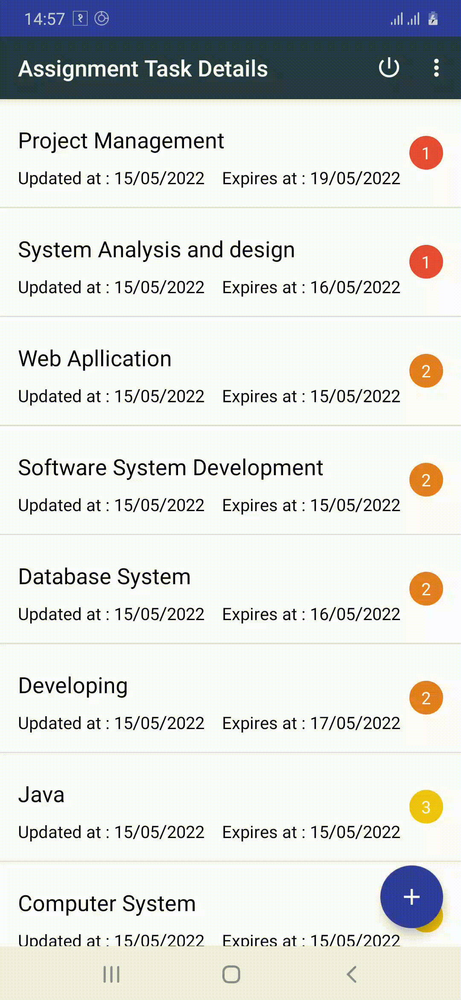
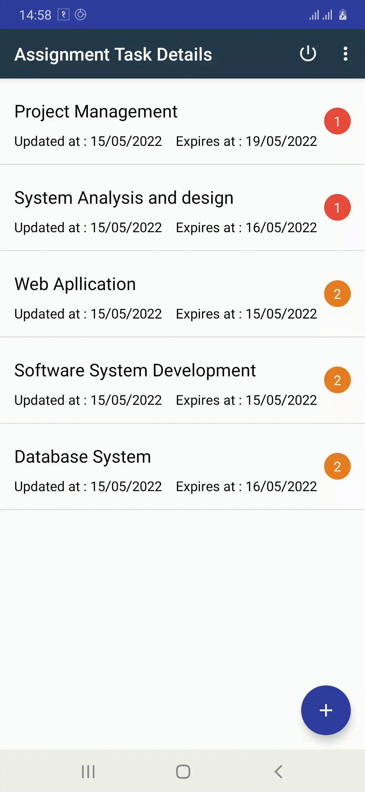

# Todo Application (DMA) Application Overview

## Starting Android Application

## Registration
- Before using any feature first we need to register for valid user.
- There are different types of validation in our registration form.
- If the credential was fully succeed then we get access to our Valid User.

## User Login Credential
- There are also validation in our Login Form.
- If username and password is not valid then it will aborted to logged in session.
- After successfully logged in to our system user can add, update and delete their Task.

## Add List item
- By the help of (+) sign user can add their Assignment details.
- To add their task into list item user have to fill up all of the criteria.
- User can add title for their task.
- User can also add text by the help of voice assistance.
- User can add priority for their task.
- User can also set the deadline for their task.

## Update List Item
- After adding task to their list item, user can update their task.
- Their are list of items shown according to their priority, in the main List menu.
- In task Menu User can edit their title, also change their priority and can change their date.

## Deleting List Item
- Users can also delete their task according to their priority.
- As you can see in the right side of the screen there are certain level of priority displayed.

## Deleting all items and Logged Out.
- Users can delete all of their task from task menu.
- Users can also logout from application by simply clicking logout icon in menu bar.

